# Design Document – Team 12
## 1 Introduction

In an increasingly complex and fast paced society, there is a strong need to do more with less. Therefore, it seems  prudent to introduce a tool to help users get organized and maximize their productivity.

The software product delivered at the end of this project will be an Android App titled, TODO. TODO is a mobile Android application that will enable multiple users to manage their tasks via an intuitive and responsive UI.

TODO will be capable of adding items to, deleting items from, and editing items in a list. Users will be able to add tasks and specify attributes such as the task's name, priority and due date. Moreover, any lists that are edited will be saved automatically and immediately to prevent data loss.

At the end of this project, the client will receive the TODO Android app along with a user manual.

## 2 Design Considerations

### 2.1 Assumptions

* The users know how to install and run Android Apps.  
* The users are familiar with Android OS elements and general flow of Apps in the platform.  
* The system shall require Android Ice Cream Sandwich (version 4.0.3) and above.
* The system shall be targeted to run optimally on smartphone-sized devices. The system may have a specific layout for tablet-sized devices.  
* The system shall store all of its data locally, without relying on an external database.
* The system's language shall be English.   

### 2.2 Constraints
Describe any constraints on the system that have a significant impact on the design of the system.

* The system shall run on Android devices.
* The system shall use SQLite as a database engine.
* The system shall not display "Application Not Responding" (ANR) dialogs.   

### 2.3 System Environment

The system shall operate in touch-based devices (smartphones and tablets) running Android Ice Cream Sandwich (version 4.0.3) and above. These devices may not necessarily have a reliable internet connection.

## 3 Architectural Design

### 3.1 Overview
The system will follow mostly a **Layered Architecture** in which each layer is allocated a specific set of responsibilities of the system. There will be four layers: the *Application Layer*, the *Presentation Layer*, the *Business Layer*, and the *Persistence Layer*.  

The *Application Layer* shall be in charge of displaying the GUI, capturing user input, and interfacing with the Presentation Layer below it.  

The *Presentation Layer* shall interpret the data coming from the Application Layer and convert it into logical units to be delivered it to the Business Layer. It will also receive data from the Business Layer, format it and deliver it to the Application Layer.  

The *Business Layer* shall determine how data needs to be processed and be stored and delivered in the system. This layer will be in charge of the creation, modification, and deletion of Tasks and Users.  

The *Persistence Layer* shall be in charge of storing data in between sessions. It will rely on a SQLite database.  

The interaction in between the Application Layer and the Presentation Layer will follow an *Event-driven Architecture*.  

### 3.2 Rationale
Event-driven architecture is used across most Android Apps with a GUI. The app relies on user actions (events) to perform activities.  

Layered Architecture enables workload distribution: given the short timeframe of the project, different members of the team can focus on specific layers with minimal dependencies with the rest of the team members. It also offers the possibility of increasing or decreasing the level of abstraction of each layer, reducing the need to detail the way Android-driven components work. Other benefits of Layered Architecture are:
* Manageability: besides allowing workload distribution, separation of functionality across layers can help identify dependencies.
* Testability: by separating the system into layers it becomes easier to identify the nature of the unit tests and prioritize them. The team identified unit tests for the code at the Business Layer should be prioritized.
* Reusability: establishing roles promotes reusability of the code.

### 3.3 Conceptual (or Logical) View

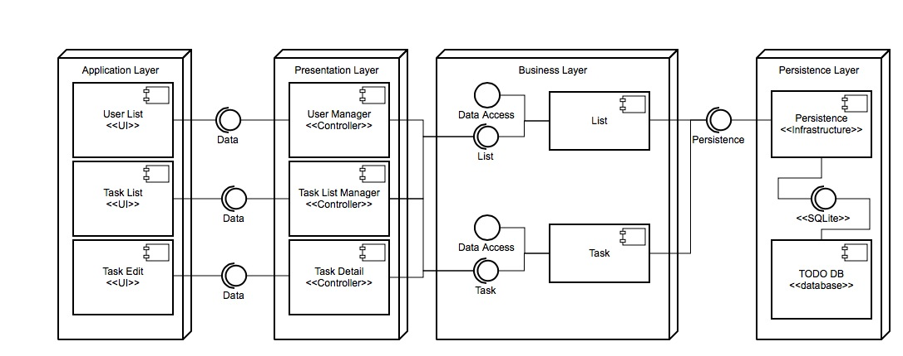

## 4 Low Level Design
Describe the low-level design for each of the system components identified in the previous section. For your component, you should provide details in the following UML diagrams to show its internal structure.

### 4.1 Class Diagram
In the case of an OO design, the internal structure of a software component would typically be expressed as a UML class diagram that represents the static class structure for the component and their relationships (association, aggregation, generalization, etc.)  

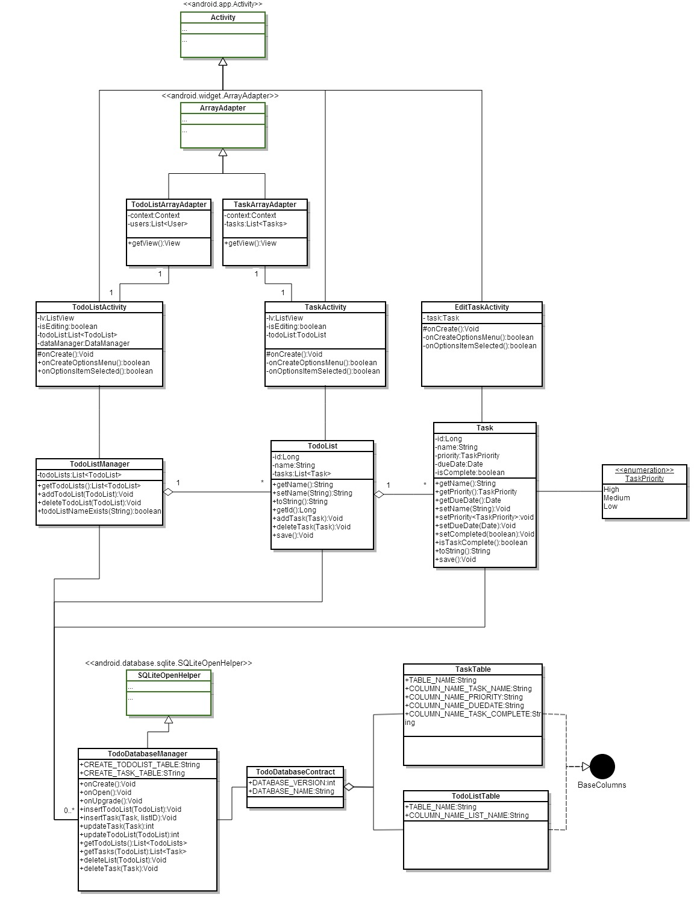

### 4.2 Sequence Diagram
This diagram shows details of how and in which order objects within a component interact with one another.

  

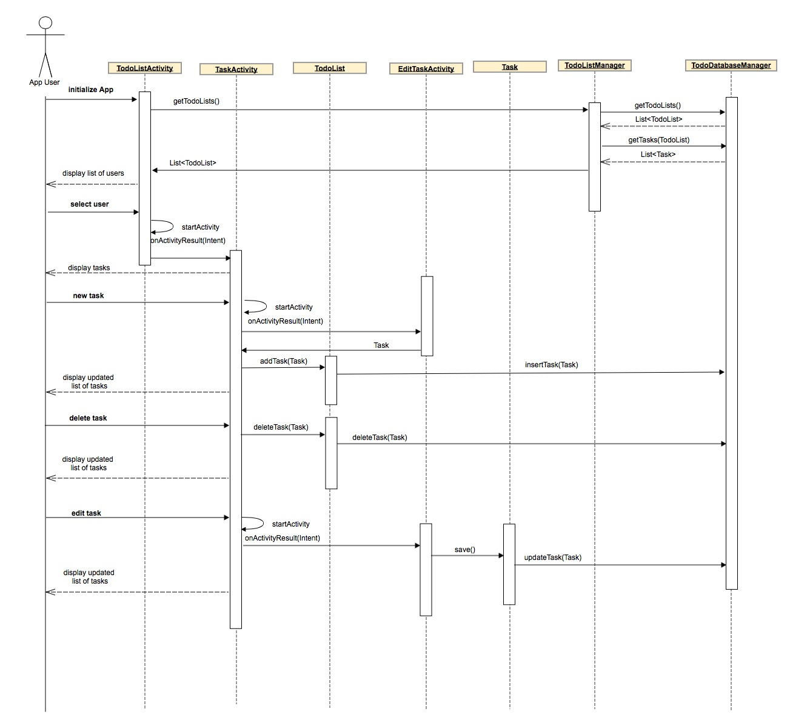  

### 4.3 Component Diagram
The component diagram can be seen in section 3.3.

### 4.4 Database Schema
The figure below shows an Entity Relationship Diagram (ERD) describing the database schema. It is worth noting, that internally we are naming the table that stores the users as *todoList*. If development time permits, we will add an additional table, *users*, to support multiple todo-lists per user. 

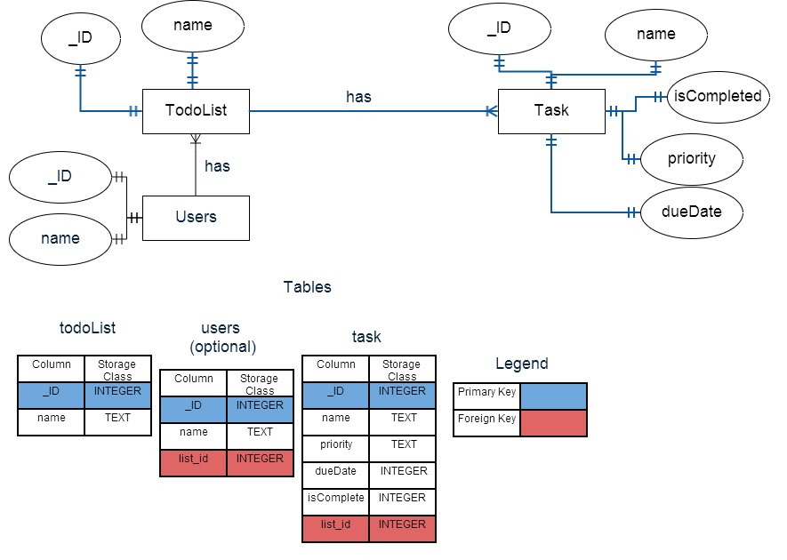  

## 5 User Interface Design

The software shall follow a standard Android OS App look and feel. Across the top of every screen there will be an Action Bar, that is a bar that will contain from left to right: the icon of the App, the title of the section currently being displayed, and 2 or more buttons to perform actions on the data on screen. The Action Bar will display up to two buttons on the right. If 3 or more buttons are required for the actions available in a specific section, the Action Bar will display an overflow menu button (or the overflow menu hardware button will become active, depending on the device). When the overflow menu is requested, it will display the buttons that did not fit in the Action Bar.  

The section's data will be displayed below the Action Bar. There will be two types of data being displayed: List data, and detail data. List data will be presented as a succession of rows where each row will present a unit of data (a user, a task, etc.). Detail data will be presented in a more complex layout, where different aspects of a specific unit of data (fo example the properties of a task) are represented by different UI elements (for example, a calendar to represent a date).  

In the case the software requires small inputs of data, confirmation of an action, or the output of an error, an alert dialog will be displayed. Alert dialogs will be presented as small floating windows on top of the current content.  

All the UI elements will be designed taking into account the fact that the data may be displayed in a small screen and the user will interact with the app using a finger. As such, all interactive elements shall have a minimum size that allows the user to easily tap on them. In Android terms, these elements shall be no smaller than 20dp by 20dp.  

The user will navigate from section to section by tapping on different areas of the screen. In order to navigate up a level, the user will utilize the back hardware button.

### 5.1 Users Screen

This screen will be the one the user sees when launching the software for the first time, or after it has been terminated. Initially, the software will have one list called 'Default.' The user name can be updated in the edit mode by clicking the Edit button at the top. The user can also be deleted in the edit mode as well. New users can be added using the Add button at the top. Tapping on the user name will display the tasks for that user.  

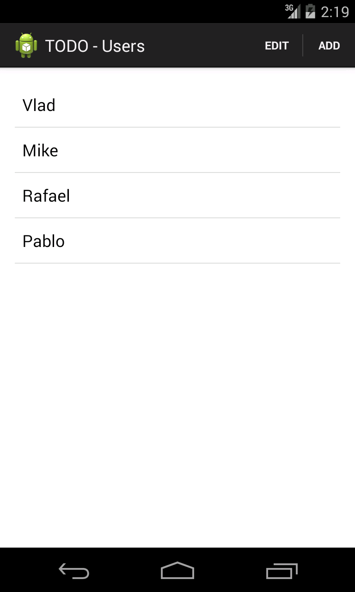

#### 5.1.1 Users Screen - Edit Mode

After the Edit button is pressed in the top right corner of the app the list of users enters edit mode. In the edit mode, for each user row there will be 2 buttons displayed, Edit and Delete. The name of a user can be modified using the Edit button and a user can be deleted using the Delete button. Once all desired changes are completed on the individual lists, users will need to click on Done button at the top to exit the edit mode.

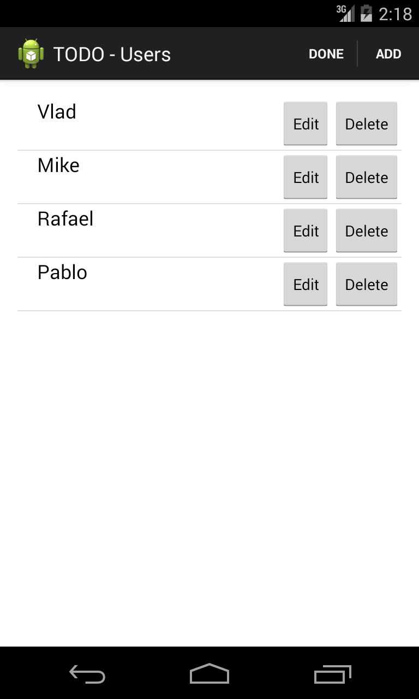

#### 5.1.2 Users Screen - Deleting a User

Delete will display a confirmation dialog that will allow users to delete the user permanently or cancel the delete action.    

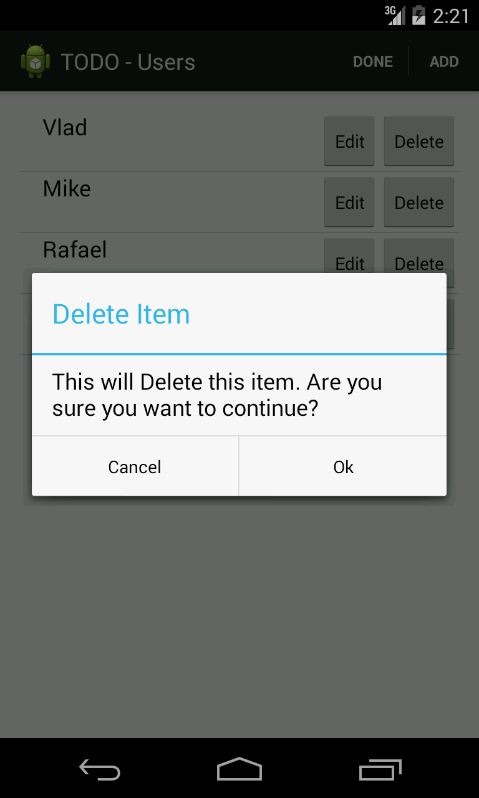

#### 5.1.3 Users Screen - Editing a User

Edit will display a confirmation dialog with a text field for the user name. The text field will be pre-populated with the name of the user being edited. Tapping on Cancel will leave the record unchanged and tapping on Save will persist the changes made to that user name.  

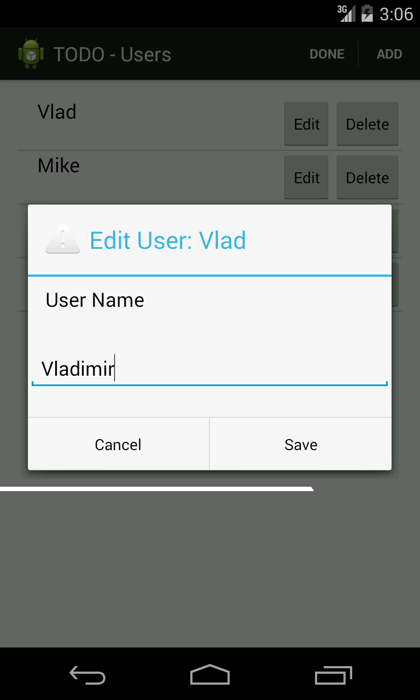

#### 5.1.4 Users Screen - Adding a User

Add will display a confirmation dialog with a text field for the user name. Tapping on Cancel will dismiss the dialog without creating the user and tapping on Create will create a user with the user name entered. 

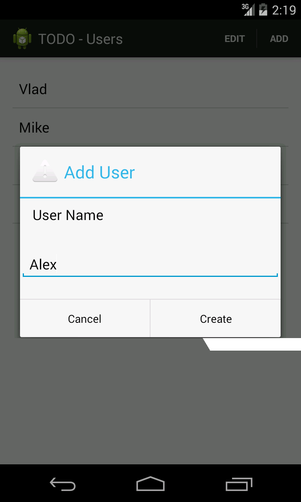  

### 5.2 Tasks Screen

Once the user taps on a user name, he or she will be presented with this screen. The screen contains a list of tasks. On the right side of each task there is a color-coded flag that identifies the priority of the item. The due date is displayed underneath the task name. There are two action buttons at the top, Edit and Add, as well as a overflow menu.  

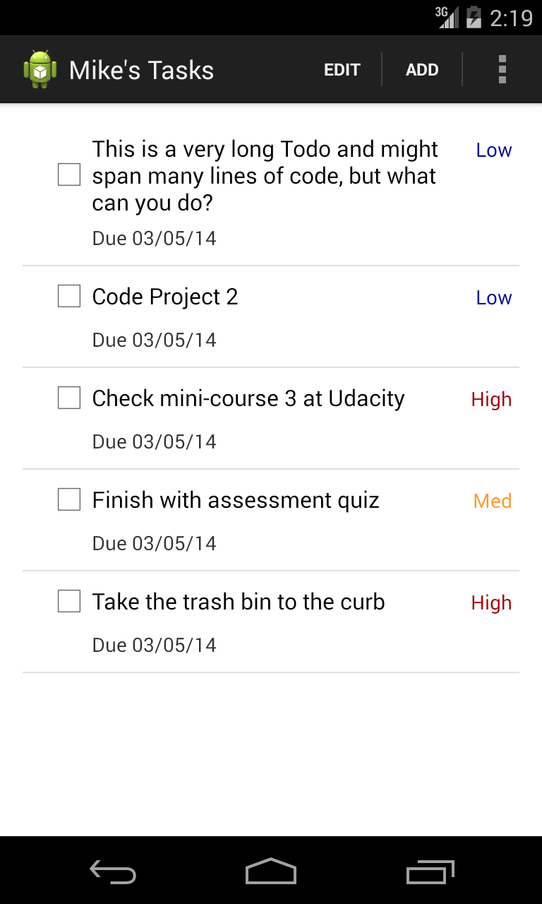 

#### 5.2.1 Tasks Screen - Checking and Unchecking Tasks

By tapping on the checkbox next to each task or the name of the task, the user is able to check/uncheck tasks off the list.  

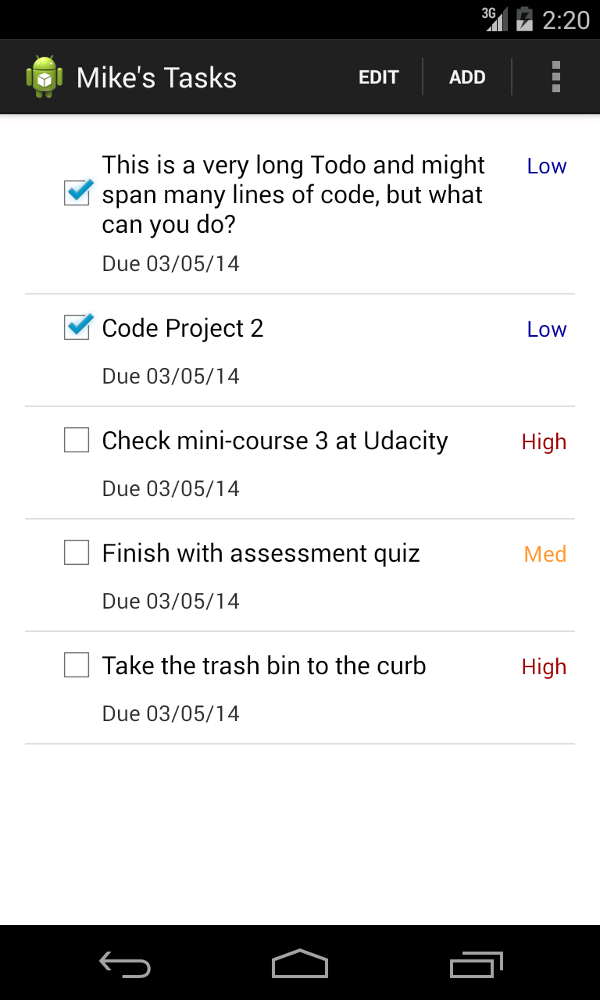  

#### 5.2.2 Tasks Screen - Overflow menu

Tapping on the overflow menu icon (or the overflow menu physical button, depending on the hardware) will display the overflow menu. This menu contains an option to show\hide checked items. The overflow menu can accommodate future features such as sorting by priority or due date.  

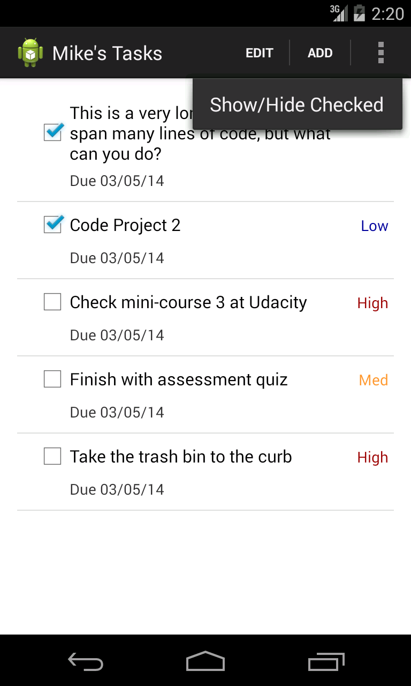  

#### 5.2.3 Tasks Screen - Edit Mode

After the Edit button is pressed in the top right corner of the app the list of tasks enters edit mode. In the edit mode, for each task row there will be 2 buttons displayed, Edit and Delete. The details of a task can be modified using the Edit button. When the Edit button is pressed, a pre-populated detail of the task will be displayed with the data for the particular task being edited (view screen 5.3). A task can be deleted using the Delete button. Once all desired changes are completed on the individual lists, users will need to click on Done button at the top to exit the edit mode.  

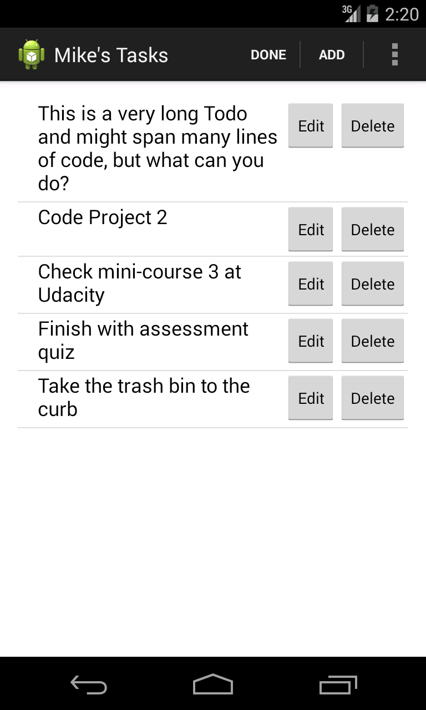 

#### 5.2.4 Users Screen - Deleting a Task

Delete will display a confirmation dialog that will allow users to delete the task permanently or cancel the delete action.    

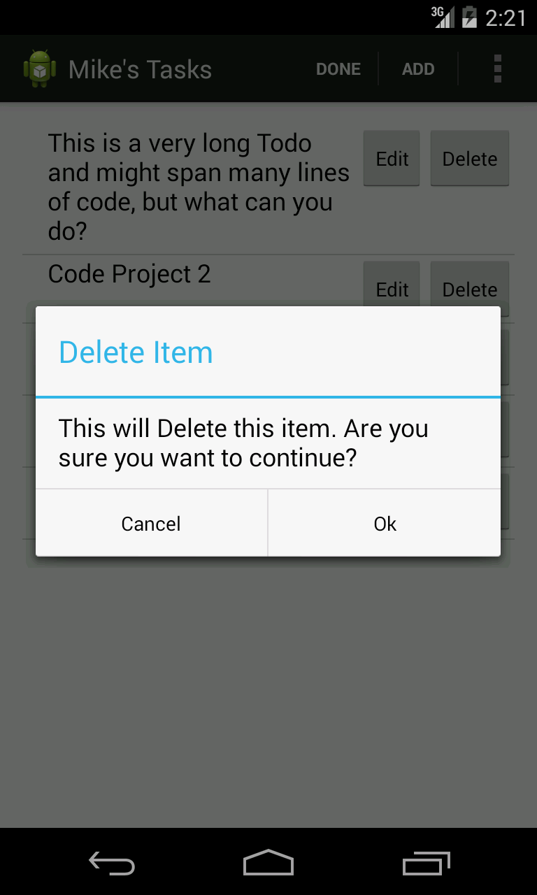

### 5.3 Task Detail Screen

This screen will allow the user to add or edit a task. If the user is editing a task, the different fields of this screen will be pre-populated with the data of that specific task. There is an editable text field to enter the name/description of the task. The priority of the task can be set by choosing one of the three priority values (the default value is 'Med'). The selection of the radio buttons will be mutually exclusive (only one radio button can be selected at any given time). Finally, the due date for the task can be specified using the date picker (default date is one day after the current date). Tapping on Save at the top will either save the changes or add the task. Tapping on Cancel will dismiss this screen without making any modifications to the data.  
 
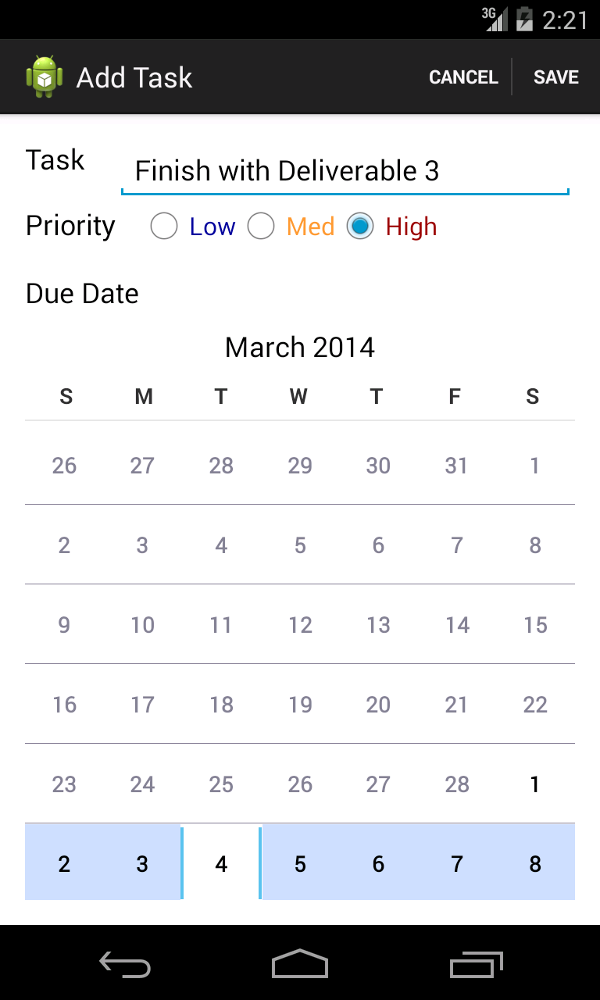
